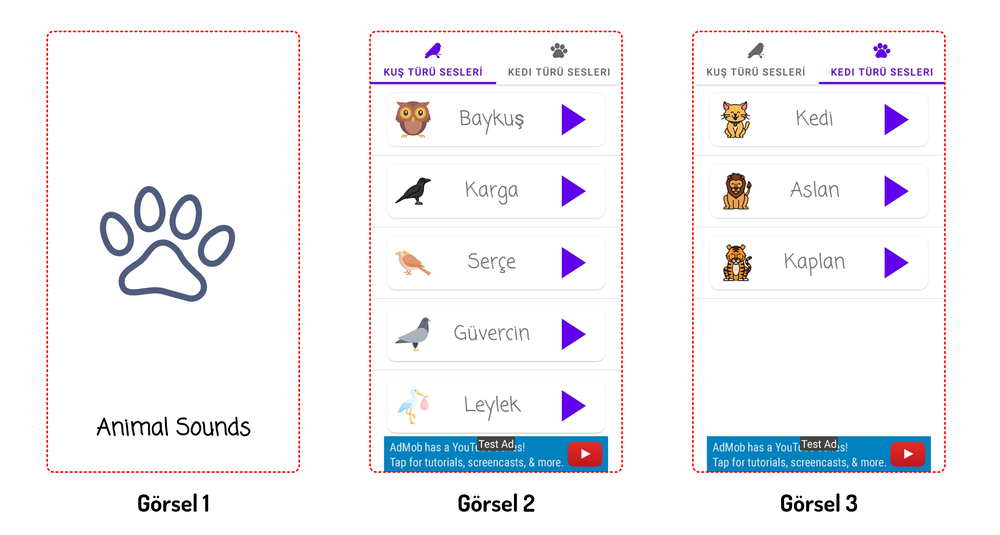
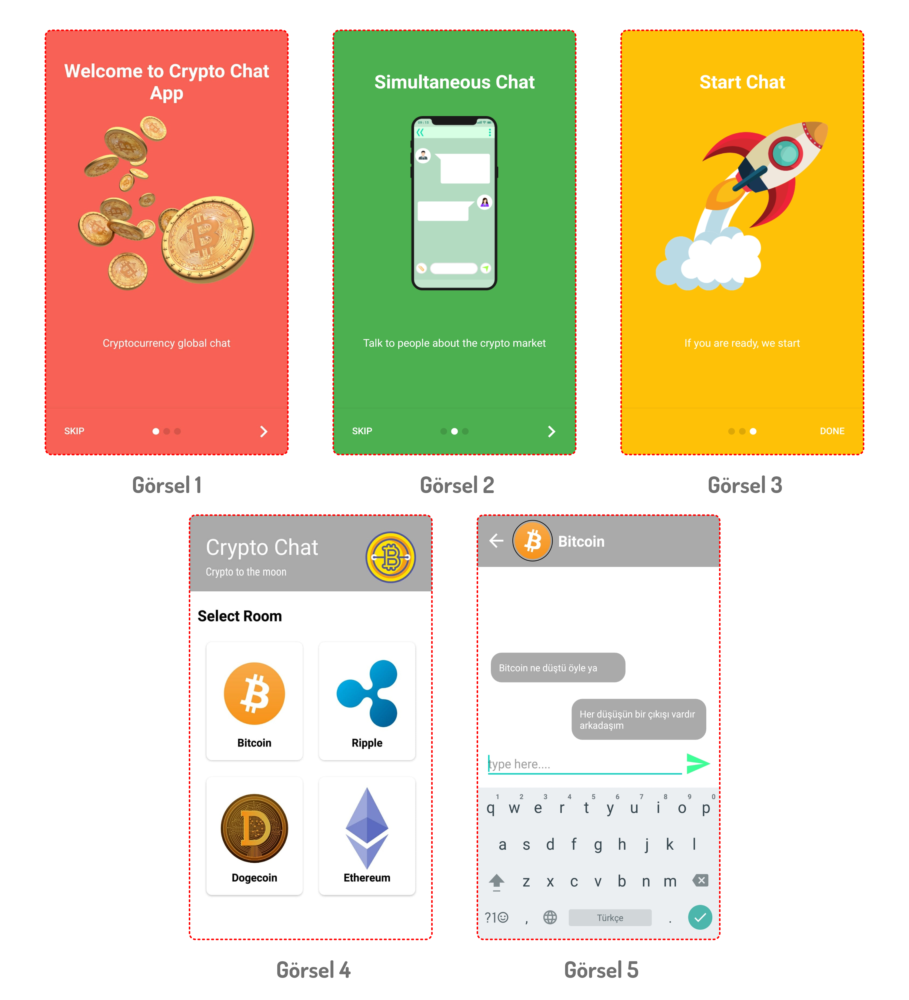
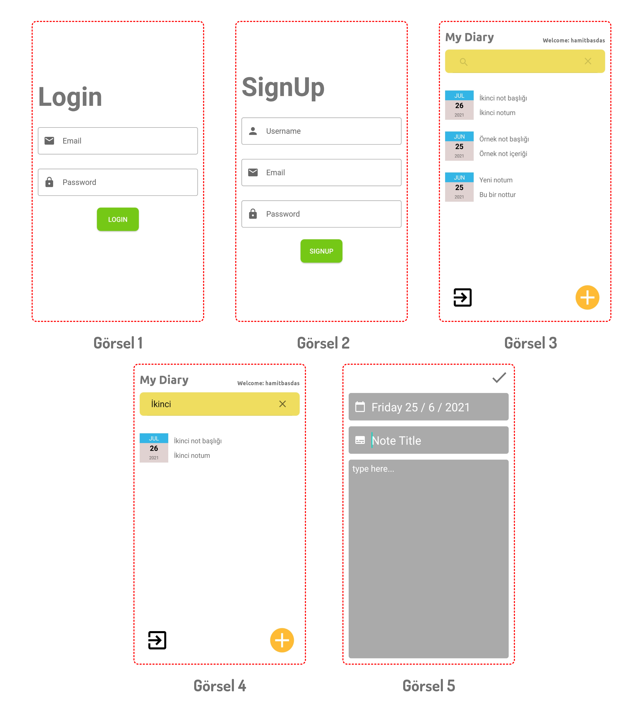

# 3 Mobil Uygulama Tasarımları

**Merhaba**,

Bundan 20 gün önce Udemy üzerinden Android için yeni bir kurs hazırlamaya başladım. Kursa ait uygulamaların tüm kodları ve tasarımları şu an bitmiş durumda. Size bu bu uygulamaların tasarımlarını paylaşacağım. 

Yakında Udemy'de...

## Animal Sounds (Basit Seviye) :  

Uygulamada belirli hayvanların sesleri bulunuyor. Herhangi bir hayvan resmine tıklanması durumunda tıklanan hayvanın sesi çalıyor. Bu kadar basit :)

**Görsel 1 :** Uygulama açılışında karşılaşılan Intro Activity.  Sayfa ortasındaki pati resmi LottieFiles animasyonudur.  Alt tarafında ise uygulamamızın ismi yer almaktadır.

**Görsel 2-3:** Uygulama açılışından sonra karşılaşacağınız sayfadır. Üst taraftaki "Kuş Türü Sesleri" ve "Kedi Türü Sesleri" bölümü TabLayout yapısı kullanılmıştır. Sayfa ortasındaki bölüm ViewPager kullanarak hazırlanmış bu  sayede birden fazla aktivite kullanımı engellenmiştir. Alt tarafa da küçük bir banner eklendi.

## Crypto Chat (Orta Seviye) :

Popülerleşen **Kripto Para** piyasalarından dolayı insanların istedikleri **coin** ile ilgili eş zamanlı olarak sohbet edebilecekleri bir uygulama özetlemek gerekirse. Bu uygulamanın kahramanını ***Firebase*** olarak seçiyorum çünkü verilerin hızlı bir şekilde aktarımı ve ücretsiz olması bana büyük bir kolaylık sağladı. 

**Görsel 1-2-3:** AppIntro adı verilen paket ile bu 3 sayfa basit bir şekilde oluşturulmuştur. "Skip" veya "Done" butonlarına basılınca uygulamaya ***firebase*** üzerinden **anonim** şekilde giriş yapılır. Bu sayede atılan her mesajın bir sahibi olacaktır.

**Görsel 4:** Konuşmak istenilen odaya tıklanır ve "Görsel 5" sayfasına gidilir. 

**Görsel 5:** Bu sayfada her şey dinamik hazırlanmıştır. Sayfadaki üst kısımdan mesajlara kadar her veri ***firebase*** üzerinden çekilmektedir. Mesajlaşma olayı eşzamanlı bir şekilde sağlanmıştır. 

## My Diary (İleri Seviye) : 

Vee geldik son ileri seviye olarak adlandırdığım uygulamamıza. Sebebi ise uygulama içerisinde her kullanıcının kişisel bir hesabının olması, kendine ait notlarının cihazının belleğinde değil de ***Firebase*** üzerindeki bir veritabanı tarafında saklanması olarak özetle açıklanabilir.

**Görsel 1-2:** Bir önceki uygulamamızda gösterdiğim için bu uygulamamızda herhangi bir Intro Activity yok :). Uygulamaya direkt "Login" ve "SignUp" sayfaları ile başlıyoruz. Bu sayfalar ViewPager ile birbirlerine bağlı olduğundan kaydırmalı görünüme sahiptir. "Login" ve "SignUp" işlemleri ise ***firebase*** kullanılarak hazırlanmıştır.

**Görsel 3:** Bu sayfada daha önceden kişisel hesaba kaydedilen notların sıralanır. Herhangi bir nota tıklama hâlinde ise ***"Görsel 5"*** sayfasına gider ve not bilgileri orada görüntülenir.

**Görsel 4:** Kullanıcı notlarını üst taraftan aratarak istediği nota kolaylıkla ulaşabilecektir. Aramalar not başlığına göre sıralanmıştır.

**Görsel 5:** Not eklemek için oluşturulan bu sayfada "Tarih", "Başlık" ve "Yazı" olmak üzere 3 bölüm bulunmaktadır. Bu bölümler boş bırakılmaması hâlinde hesabınıza kaydedilir ve ***"Görsel 3"*** sayfasında sıralanır.

En yakın zamanda uygulamaların yapılış videolarını çekeceğim. Umarım başarabilirim :) 

Udemy'de tekrar görüşmek üzere :),
 
Kendinize çok dikkat edin,
 
Öğrenmeyi bırakmayın,
 
Hoşça kalın... :))